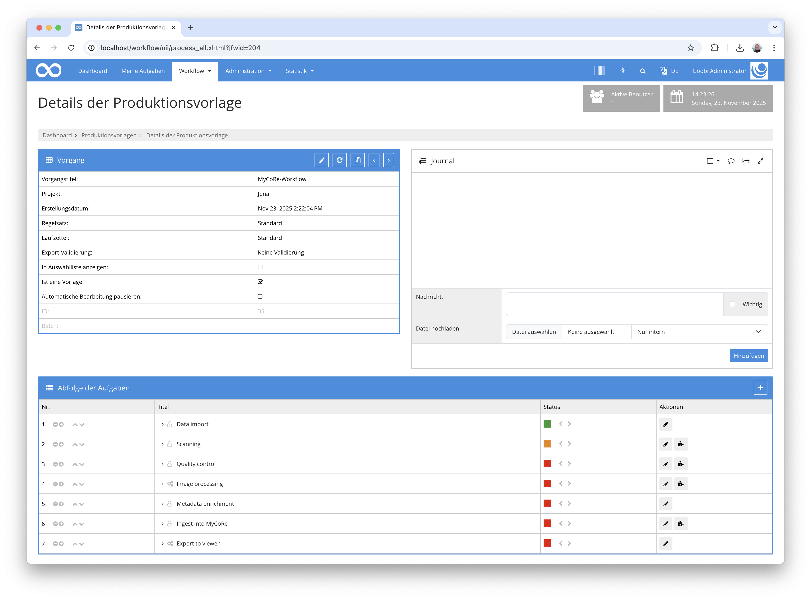
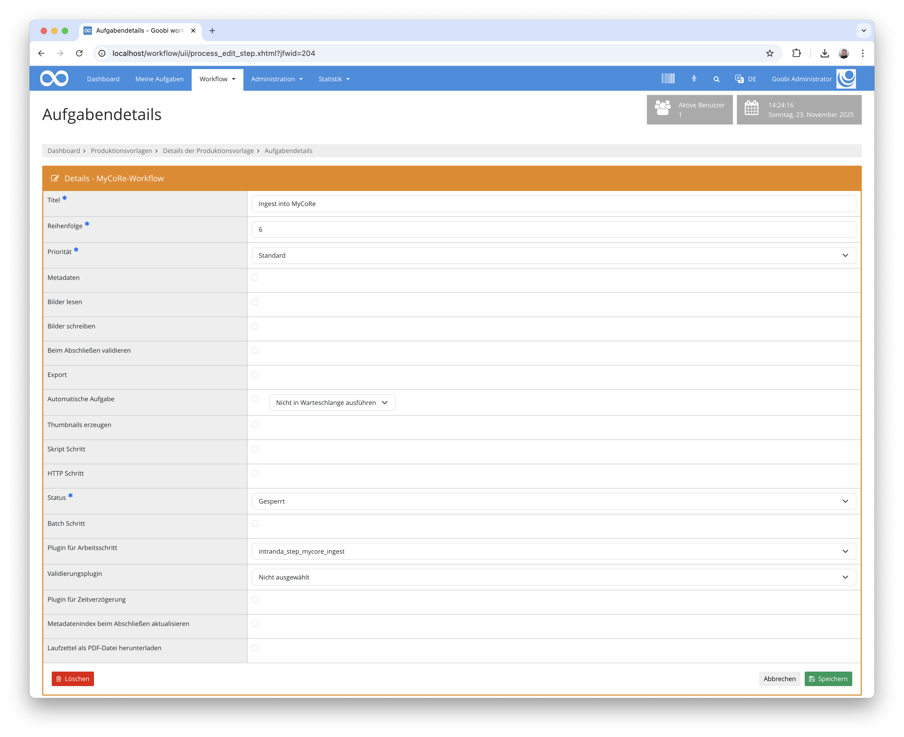

## Einführung
Diese Dokumentation erläutert das Plugin für den automatisierten Ingest in ein MyCoRe Repository.

## Installation
Um das Plugin nutzen zu können, müssen folgende Dateien installiert werden:

```bash
/opt/digiverso/goobi/plugins/step/plugin-step-mycore-ingest-base.jar
/opt/digiverso/goobi/config/plugin_intranda_step_mycore_ingest.xml
```

Nach der Installation des Plugins kann dieses innerhalb des Workflows für die jeweiligen Arbeitsschritte ausgewählt und somit automatisch ausgeführt werden. Ein Workflow könnte dabei beispielhaft wie folgt aussehen:



Für die Verwendung des Plugins muss dieses in einem Arbeitsschritt ausgewählt sein:




## Überblick und Funktionsweise
Wenn der Arbeitsschritt mit diesem Plugin aktiviert wird, startet dieses den Ingest in MyCoRe. Dafür wird zunächst eine Transformation der METS-Datei durchgeführt, indem eine METS-Datei exportiert und dann mittels einer xsl-Datei von einer konfigurierbaren URL transformiert wird. Mit der so erzeugten XML-Datei wird anschließend in MyCoRe ein Band angelegt und darin ein Derivat erzeugt. Innerhalb des Derivats werden anschließend die Mediendateien, die Volltextdateien sowie die METS-Datei zusammen mit der Anchordatei hochgeladen. 

Abschließend werden die Checksummen und Größen der Dateien ermittelt und verglichen und als Ingest-Quittung innerhalb des Vorgangsjournals abgelegt.


## Konfiguration
Die Konfiguration des Plugins erfolgt in der Datei `plugin_intranda_step_mycore_ingest.xml` wie hier aufgezeigt:

{{CONFIG_CONTENT}}

{{CONFIG_DESCRIPTION_PROJECT_STEP}}

Parameter               | Erläuterung
------------------------|------------------------------------
`xslt-url`              | Angabe der URL, unter der eine xsl-Datei für die Transformation erreicht werden kann. Eine Beispieldatei befindet sich innerhalb des `docs`-Verzeichnisses des Plugins.
`mycore-api`            | URL für die MyCoRe-API
`mycore-login`          | Angabe des Login Namens
`mycore-password`       | Angabe des Login Passworts
`max-tries`             | Angabe über die maximale Anzahl an Versuchen, die für den Ingest genutzt werden soll
