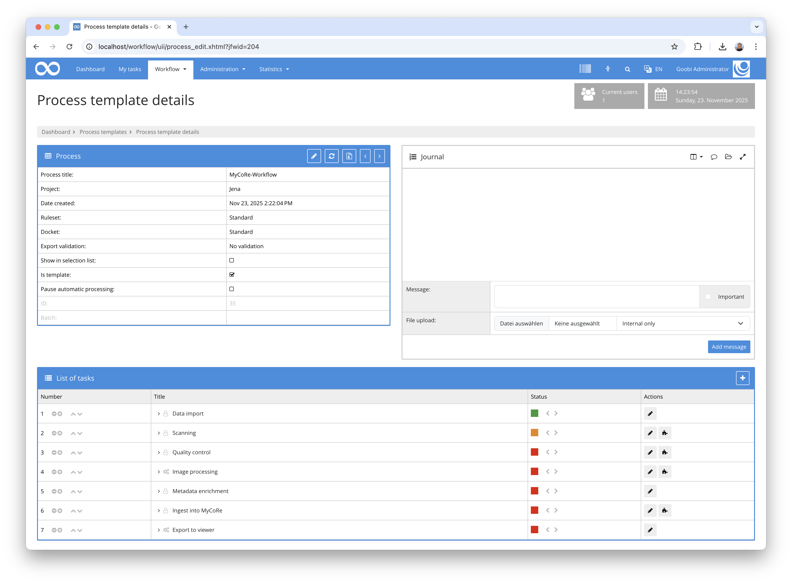
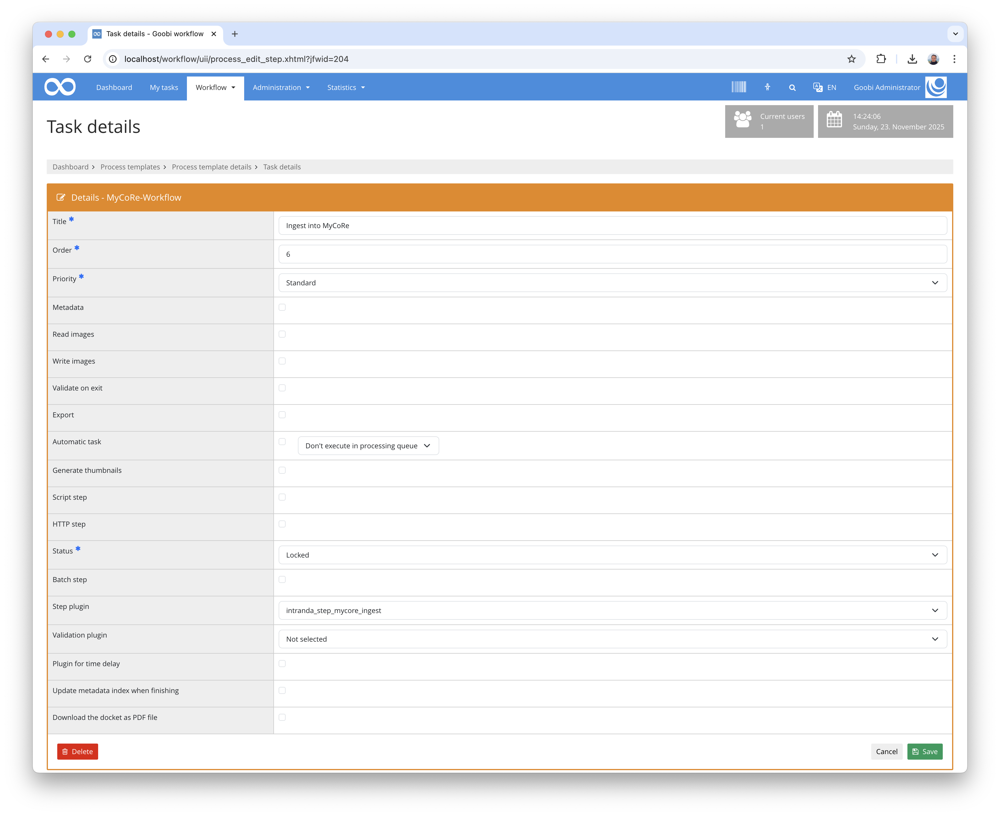

## Introduction
This documentation explains the plugin for automated ingest into a MyCoRe repository.

## Installation
To use the plugin, the following files must be installed:

```bash
/opt/digiverso/goobi/plugins/step/plugin-step-mycore-ingest-base.jar
/opt/digiverso/goobi/config/plugin_intranda_step_mycore_ingest.xml
```

After installing the plugin, it can be selected within the workflow for the respective work steps and thus executed automatically. An example workflow could look like this:



To use the plugin, it must be selected in a work step:




## Overview and functionality
When this plugin is activated, it starts the ingest process in MyCoRe. To do this, the METS file is first transformed by exporting a METS file and then transforming it using an xsl file from a configurable URL. The XML file generated in this way is then used to create a volume in MyCoRe and a derivative is generated within it. The media files, full-text files and METS file are then uploaded together with the anchor file within the derivative. 

Finally, the checksums and sizes of the files are determined and compared, and stored as an ingest receipt within the process journal.


## Configuration
The plugin is configured in the file `plugin_intranda_step_mycore_ingest.xml` as shown here:

{{CONFIG_CONTENT}}

{{CONFIG_DESCRIPTION_PROJECT_STEP}}

Parameter               | Explanation
------------------------|------------------------------------
`xslt-url`              | Specify the URL where an xsl file for the transformation can be accessed. A sample file is located in the `docs` directory of the plugin.
`mycore-api`            | URL for the MyCoRe API
`mycore-login`          | Enter your login name
`mycore-password`       | Enter your login password
`max-tries`             | Information about the maximum number of attempts to be used for ingest
